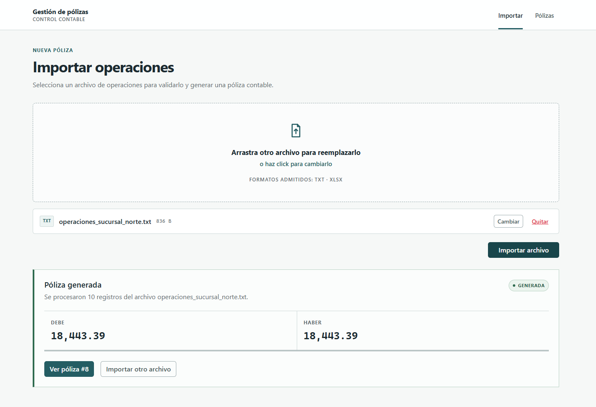
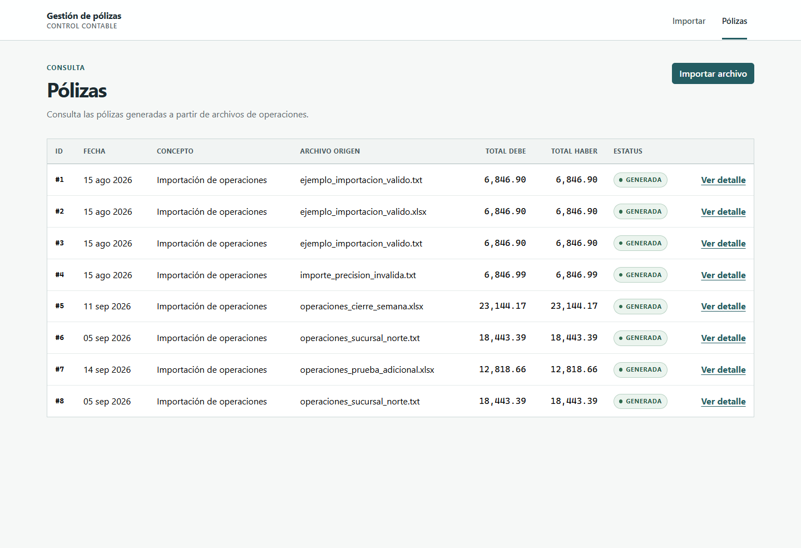
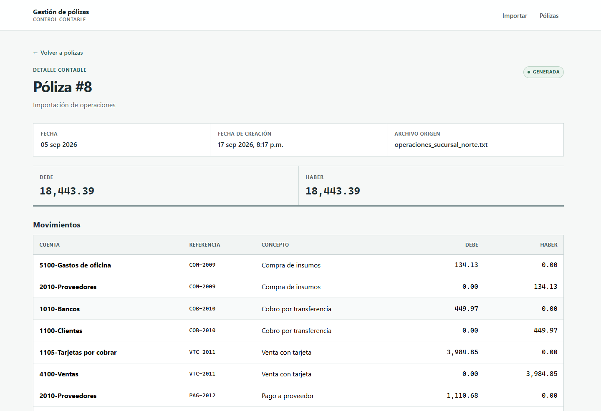

# Gestión de pólizas contables

Aplicación Full Stack para importar operaciones contables desde archivos TXT o XLSX, validar su contenido, generar una póliza balanceada y consultar sus movimientos.

El flujo general es:

```text
archivo
→ lectura y parsing
→ normalización y validación
→ generación de póliza y movimientos
→ validación de balance
→ persistencia atómica
→ consulta desde la interfaz o la API
```

Cada operación válida genera un movimiento de cargo y otro de abono. Si cualquier fila contiene un error, la importación completa se rechaza y no se persiste información parcial.

## Interfaz

### Importación de archivos



### Consulta de pólizas



### Detalle contable



## Stack principal

- Backend: Java 21, Spring Boot, Spring Data JPA, Flyway, Apache POI y Maven.
- Base de datos: MySQL 8.x.
- Frontend: Vue 3, JavaScript, Vue Router, Bootstrap 5.3 y Vite.

## Estructura del repositorio

```text
.
├── backend/       # API REST, dominio, importación y persistencia
├── frontend/      # Aplicación Vue
├── docs/          # Contrato y decisiones técnicas
├── samples/       # Archivos válidos e inválidos de ejemplo
├── api.http       # Solicitudes de ejemplo para la API
└── README.md
```

## Requisitos

- Java 21.
- Maven Wrapper incluido; no es necesario instalar Maven globalmente.
- MySQL 8.x. El desarrollo y las pruebas locales se realizaron con MySQL 8.4.
- Node.js `^20.19.0` o `>=22.12.0`, según el requisito de Vite 8.3 incluido en el proyecto.
- npm. El proyecto no fija una versión exacta; debe utilizarse una versión compatible con el Node.js instalado.

## Base de datos

`prueba_tecnica_leyva` es un nombre sugerido para la base de datos; no es un nombre obligatorio configurado por la aplicación.

Antes de iniciar el backend, se puede crear una base vacía con:

```sql
CREATE DATABASE prueba_tecnica_leyva CHARACTER SET utf8mb4;
```

El backend obtiene la conexión mediante variables de entorno:

```text
DB_URL=jdbc:mysql://localhost:3306/prueba_tecnica_leyva
DB_USERNAME=<usuario_mysql>
DB_PASSWORD=<contraseña_mysql>
```

Los valores deben definirse en el entorno local; no deben incorporarse credenciales reales al repositorio.

Flyway aplica y valida el historial de migraciones al arrancar. La migración inicial crea las tablas, restricciones e índices de la aplicación. Hibernate usa `ddl-auto: validate`, por lo que valida el esquema resultante, pero no lo crea ni lo modifica automáticamente.

## Ejecución del backend

Desde `backend/`:

```bash
# Linux o macOS
./mvnw test
./mvnw spring-boot:run
```

En Windows PowerShell:

```powershell
.\mvnw.cmd test
.\mvnw.cmd spring-boot:run
```

Las variables `DB_URL`, `DB_USERNAME` y `DB_PASSWORD` deben estar disponibles al iniciar Spring Boot. De forma predeterminada, la API queda disponible en `http://localhost:8080`.

## Ejecución del frontend

Desde `frontend/`:

```bash
npm ci
npm run dev
```

Comandos de verificación:

```bash
npm test
npm run build
```

Durante el desarrollo, Vite sirve la interfaz y redirige las solicitudes a `/api` hacia el backend. El destino predeterminado es `http://localhost:8080` y puede cambiarse con `BACKEND_TARGET`, como se muestra en [`frontend/.env.example`](frontend/.env.example).

## API REST

| Método | Endpoint | Descripción |
| --- | --- | --- |
| `POST` | `/api/importaciones` | Recibe exactamente un archivo en el campo multipart `archivo` y genera una póliza. |
| `GET` | `/api/polizas` | Devuelve el listado resumido de pólizas. |
| `GET` | `/api/polizas/{id}` | Devuelve una póliza con sus movimientos. |

El contrato completo, incluyendo respuestas y errores, está en [`docs/CONTRATO_REST.md`](docs/CONTRATO_REST.md). [`api.http`](api.http) contiene solicitudes ejecutables contra `http://localhost:8080`.

## Formatos soportados

- TXT codificado en UTF-8 y separado por `|`.
- XLSX con exactamente una hoja de datos.
- Encabezados obligatorios y con nombres exactos: `fecha`, `referencia`, `concepto`, `cuenta_cargo`, `cuenta_abono`, `importe`. El orden de las columnas puede variar.
- En TXT, la fecha debe expresarse como `yyyy-MM-dd`.
- En XLSX, la fecha puede ser una fecha nativa de Excel o texto `yyyy-MM-dd`.
- El importe debe ser mayor que cero y tener como máximo dos decimales significativos. Los importes textuales usan punto decimal, sin símbolo de moneda ni separadores de miles.

La importación utiliza una estrategia **all-or-nothing**: ante cualquier error se reportan las validaciones encontradas y no se persiste ninguna póliza ni movimiento del archivo.

## Archivos de ejemplo

- [`samples/validos/`](samples/validos/) contiene archivos TXT y XLSX aceptados por la aplicación.
- [`samples/invalidos/`](samples/invalidos/) contiene casos para comprobar las principales validaciones.

El detalle de cada muestra está en [`samples/README.md`](samples/README.md).

## Supuestos funcionales pendientes de confirmación

El requerimiento no define de forma explícita cómo obtener la fecha ni el concepto general de la póliza. Por ello se adoptaron temporalmente estas decisiones:

1. Todas las operaciones de un archivo deben compartir la misma fecha. Una importación con fechas distintas se rechaza y la fecha común se utiliza como fecha de la póliza.
2. El concepto general de la póliza se establece temporalmente como `"Importación de operaciones"`.

Ambas decisiones responden a ambigüedades no resueltas del requerimiento y están aisladas en el servicio de importación para facilitar su modificación cuando las reglas de negocio sean confirmadas.

## Diseño frontend

La interfaz utiliza Vue 3 y Bootstrap 5.3, con navegación, tablas responsivas y estados explícitos de carga, éxito, vacío y error. Las decisiones visuales y de interacción están resumidas en [`frontend/DESIGN.md`](frontend/DESIGN.md).

## Consideraciones futuras

Si el producto evoluciona, puede ser razonable:

- confirmar las reglas definitivas para la fecha y el concepto general de la póliza;
- incorporar paginación si el volumen de pólizas aumenta;
- evaluar idempotencia o deduplicación únicamente si negocio requiere evitar reprocesamientos;
- continuar validando y optimizando la interfaz a partir de 320 px de ancho.
